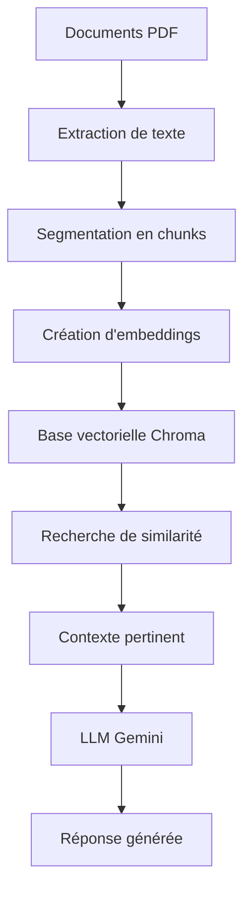

# IFRI-AI-Chatbot

Un chatbot intelligent développé pour l'Institut de Formation et de Recherche en Informatique (IFRI) qui utilise l'intelligence artificielle pour répondre aux questions des étudiants et du personnel concernant l'institution.

## 📋 Table des matières

- [Aperçu du projet](#aperçu-du-projet)
- [Architecture technique](#architecture-technique)
- [Prérequis](#prérequis)
- [Installation](#installation)
- [Démarrage](#démarrage)
- [Fonctionnement du code](#fonctionnement-du-code)
- [Structure du projet](#structure-du-projet)
- [Configuration](#configuration)
- [Utilisation](#utilisation)
- [Contribuer](#contribuer)

## Aperçu du projet

IFRI-AI-Chatbot est une application Streamlit qui utilise un modèle de langage avancés (LLM) et des techniques de Retrieval-Augmented Generation (RAG) pour fournir des réponses précises et contextuelles aux questions concernant l'Institut de Formation et de Recherche en Informatique (IFRI). Le chatbot peut traiter des documents PDF contenant des informations institutionnelles et générer des réponses pertinentes en français.


### 1. Retrieval-Augmented Generation (RAG)

Le système utilise l'approche RAG qui combine :
- **Retrieval** : Recherche d'informations pertinentes dans une base de données vectorielle
- **Generation** : Génération de réponses contextuelles avec un modèle de langage

### 2. Pipeline de traitement



### 3. Techniques d'embeddings

- **Modèle utilisé** : `sentence-transformers/all-MiniLM-L12-v2` via HuggingFace
- **Dimensionnalité** : Vecteurs de haute dimension pour capturer la sémantique
- **Similarité cosinus** : Pour trouver les documents les plus pertinents

### 4. Gestion de la mémoire conversationnelle

- **ConversationBufferMemory** : Maintient l'historique des conversations
- **Question standalone** : Reformulation des questions de suivi pour inclure le contexte
- **Compression contextuelle** : Optimisation de la récupération d'informations

## Architecture technique

### Composants principaux

1. **Interface utilisateur** : Streamlit
2. **Modèle de langage** : Google Gemini 1.5 Pro
3. **Embeddings** : HuggingFace Inference API
4. **Base vectorielle** : ChromaDB
5. **Framework** : LangChain

### Technologies utilisées

- **Python 3.8+**
- **Streamlit** : Interface web interactive
- **LangChain** : Framework pour applications LLM
- **ChromaDB** : Base de données vectorielle
- **Google Gemini** : Modèle de langage conversationnel
- **HuggingFace** : API d'embeddings
- **PyPDF** : Extraction de texte des PDF

## Prérequis

- Python 3.8 ou supérieur
- Clé API Google Gemini
- Clé API HuggingFace
- Connexion internet pour les API
- Au moins 4 GB de RAM

## Installation

### 1. Cloner le repository

```bash
git clone https://github.com/Arix-ALIMAGNIDOKPO/IFRI-AI-Chatbot.git
cd IFRI-AI-Chatbot
```

### 2. Créer un environnement virtuel

```bash
# Windows
python -m venv venv
venv\Scripts\activate

# macOS/Linux
python3 -m venv venv
source venv/bin/activate
```

### 3. Installer les dépendances

```bash
pip install -r requirements.txt
```

### 4. Configuration des clés API

Remplacez les clés API dans le fichier `Chatbot.py` :

```python
# Ligne 65 - Clé API Google Gemini
google_api_key="VOTRE_CLE_API_GOOGLE"

# Ligne 74 - Clé API HuggingFace
api_key="VOTRE_CLE_API_HUGGINGFACE"
```

> **Sécurité** : Pour un déploiement en production, utilisez des variables d'environnement pour stocker les clés API.

## Démarrage

### 1. Lancement de l'application

```bash
streamlit run Chatbot.py
```

### 2. Accès à l'interface

L'application sera accessible à l'adresse : `http://localhost:8501`

### 3. Première utilisation

Au premier lancement, le système :
1. Charge et traite tous les documents PDF du dossier `Documents/`
2. Crée les embeddings vectoriels
3. Initialise la base de données ChromaDB
4. Configure le modèle conversationnel

## Fonctionnement du code

### 1. Chargement et préparation des documents

```python
# Chargement des PDF depuis le dossier Documents
loader = PyPDFDirectoryLoader("Documents")
documents = loader.load()

# Segmentation en chunks pour optimiser la recherche
text_splitter = RecursiveCharacterTextSplitter(
    separators = ["\n\n", "\n", " ", ""],
    chunk_size = 1600,      # Taille optimale pour les embeddings
    chunk_overlap= 200      # Chevauchement pour maintenir le contexte
)
chunks = text_splitter.split_documents(documents=documents)
```

### 2. Création des embeddings et de la base vectorielle

```python
def select_embeddings_model(LLM_service="HuggingFace"):
    """Sélection du modèle d'embeddings via HuggingFace API"""
    embeddings = HuggingFaceInferenceAPIEmbeddings(
        api_key="VOTRE_CLE_API",
        model_name="sentence-transformers/all-MiniLM-L12-v2"
    )
    return embeddings

# Création de la base vectorielle persistante
vector_store = Chroma.from_documents(
    documents=chunks,
    embedding=embeddings,
    persist_directory="vector_store/Ifri"
)
```

### 3. Configuration du retriever

```python
def Vectorstore_backed_retriever(vectorstore, search_type="similarity", k=5):
    """Configuration du système de récupération par similarité"""
    retriever = vectorstore.as_retriever(
        search_type=search_type,
        search_kwargs={'k': k}  # Retourne les 5 documents les plus pertinents
    )
    return retriever
```

### 4. Chaîne conversationnelle personnalisée

```python
def custom_ConversationalRetrievalChain(llm, condense_question_llm, retriever, language="french"):
    """
    Création d'une chaîne conversationnelle en 2 étapes :
    1. Reformulation de la question avec le contexte historique
    2. Récupération de documents et génération de réponse
    """
    
    # Étape 1 : Question standalone
    standalone_question_chain = {
        "standalone_question": {
            "question": lambda x: x["question"],
            "chat_history": lambda x: get_buffer_string(x["chat_history"]),
        }
        | condense_question_prompt
        | condense_question_llm
        | StrOutputParser(),
    }
    
    # Étape 2 : Récupération et génération
    retrieved_documents = {
        "docs": itemgetter("standalone_question") | retriever,
        "question": lambda x: x["standalone_question"],
    }
    
    return conversational_retriever_chain, memory
```

### 5. Interface Streamlit

```python
# Configuration de l'interface utilisateur
st.image('ifri.png', width=200)
st.caption("Bienvenue sur le chatbot de l'IFRI !")

# Gestion des messages et de l'historique
if "messages" not in st.session_state:
    st.session_state["messages"] = [{"role": "assistant", "content": "En quoi pouvons nous vous aider ?"}]

# Traitement des questions utilisateur
if prompt := st.chat_input():
    with st.spinner('Traitement de la question en cours...'):
        response = chain_gemini.invoke({"question": prompt})
        
    # Sauvegarde dans la mémoire conversationnelle
    memory_gemini.save_context({"question": prompt}, {"answer": response['answer'].content})
```

## 📁 Structure du projet

```
IFRI-AI-Chatbot/
│
├── Chatbot.py                 # Application principale Streamlit
├── requirements.txt           # Dépendances Python
├── packages.txt              # Packages système (sqlite3)
├── ifri.png                  # Logo de l'IFRI
├── README.md                 # Documentation (ce fichier)
│
├── Documents/                # Dossier des documents source
│   ├── AOF.pdf
│   ├── Conditions de délivrance des actes académiques (2).pdf
│   ├── Offre_de_formation_licence_ifri (2).pdf
│   ├── REGLEMENT INTERIEUR.pdf
│   └── SiteWebScraping (2).pdf
│
└── vector_store/             # Base de données vectorielle (générée automatiquement)
    └── Ifri/
        ├── chroma.sqlite3
        └── ...
```

## ⚙️ Configuration

### Variables importantes à modifier

1. **Clés API** (dans `Chatbot.py`) :
   ```python
   # Google Gemini API Key
   google_api_key="VOTRE_CLE_API_GOOGLE"
   
   # HuggingFace API Key
   api_key="VOTRE_CLE_API_HUGGINGFACE"
   ```

2. **Paramètres de segmentation** :
   ```python
   chunk_size = 1600      # Taille des segments (tokens)
   chunk_overlap = 200    # Chevauchement entre segments
   ```

3. **Paramètres de récupération** :
   ```python
   k = 5                  # Nombre de documents à récupérer
   temperature = 0.5      # Créativité du modèle (0 = déterministe, 1 = créatif)
   ```

### Configuration pour le déploiement

Pour un déploiement sécurisé, créez un fichier `.env` :

```bash
GOOGLE_API_KEY=votre_cle_api_google
HUGGINGFACE_API_KEY=votre_cle_api_huggingface
```

Et modifiez le code pour utiliser `os.getenv()`.

## 🎯 Utilisation

### 1. Types de questions supportées

- **Questions générales** : "Qu'est-ce que l'IFRI ?"
- **Informations académiques** : "Quelles sont les conditions d'admission ?"
- **Règlement** : "Quel est le règlement intérieur ?"
- **Formations** : "Quelles formations sont disponibles ?"
- **Questions de suivi** : Le chatbot maintient le contexte conversationnel

### 2. Fonctionnalités

- **Réponses contextuelles** : Basées sur les documents officiels de l'IFRI
- **Mémoire conversationnelle** : Comprend les questions de suivi
- **Interface intuitive** : Chat en temps réel avec Streamlit
- **Reset de conversation** : Bouton pour recommencer une nouvelle conversation

### 3. Limitations

- **Langue** : Optimisé pour le français
- **Source** : Limité aux documents fournis dans le dossier `Documents/`
- **Connexion** : Nécessite une connexion internet pour les API
- **Tokens** : Limité par les quotas des API Google et HuggingFace

## 🔄 Workflow de traitement d'une question

1. **Réception** : L'utilisateur saisit une question
2. **Reformulation** : Si c'est une question de suivi, elle est reformulée avec le contexte
3. **Recherche vectorielle** : Recherche des documents les plus pertinents via embeddings
4. **Construction du prompt** : Combinaison du contexte, de l'historique et de la question
5. **Génération** : Le modèle Gemini génère une réponse
6. **Affichage** : La réponse est affichée à l'utilisateur
7. **Mémorisation** : L'échange est sauvegardé dans la mémoire conversationnelle

## Optimisations possibles

### Performance
- Mise en cache des embeddings
- Utilisation de modèles locaux pour réduire la latence
- Optimisation de la taille des chunks

### Fonctionnalités
- Support multilingue
- Upload dynamique de documents
- Système de feedback utilisateur
- Analytics des conversations

### Sécurité
- Authentification utilisateur
- Chiffrement des données sensibles
- Audit des conversations

## 🤝 Contribuer

1. Forkez le projet
2. Créez une branche pour votre fonctionnalité (`git checkout -b feature/AmazingFeature`)
3. Committez vos changements (`git commit -m 'Add some AmazingFeature'`)
4. Poussez vers la branche (`git push origin feature/AmazingFeature`)
5. Ouvrez une Pull Request


**Développé avec ❤️ pour l'IFRI**

[](https://github.com/Arix-ALIMAGNIDOKPO/IFRI-AI-Chatbot)